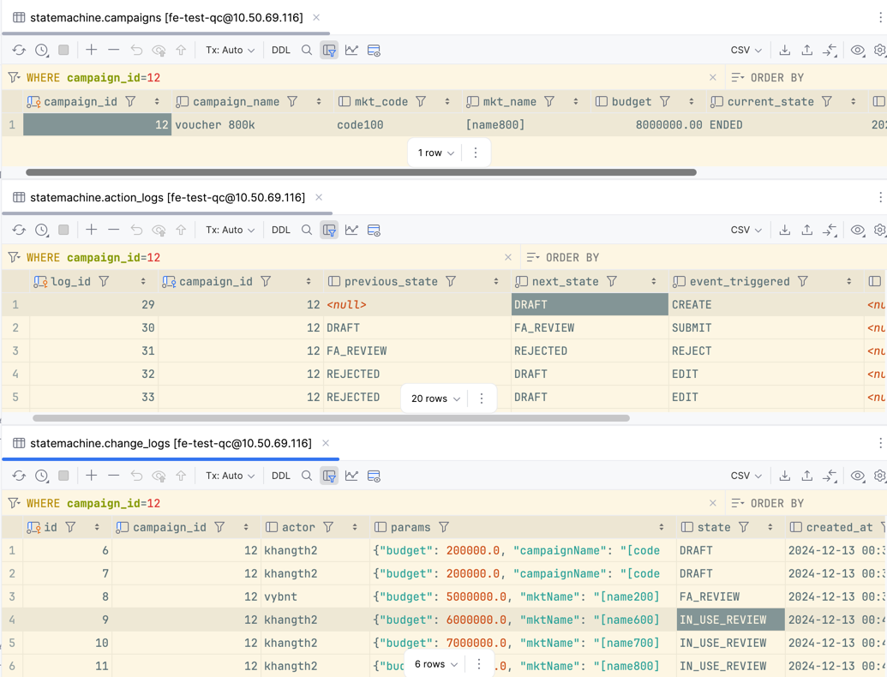
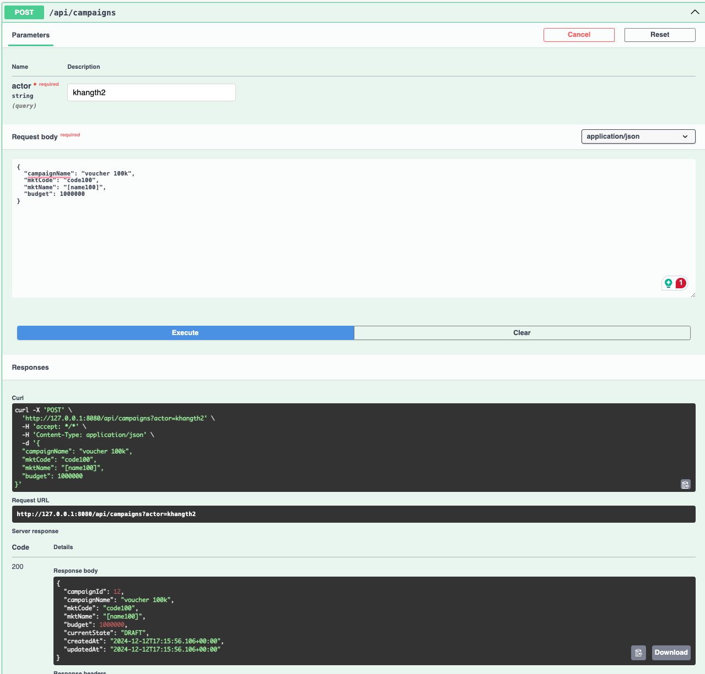
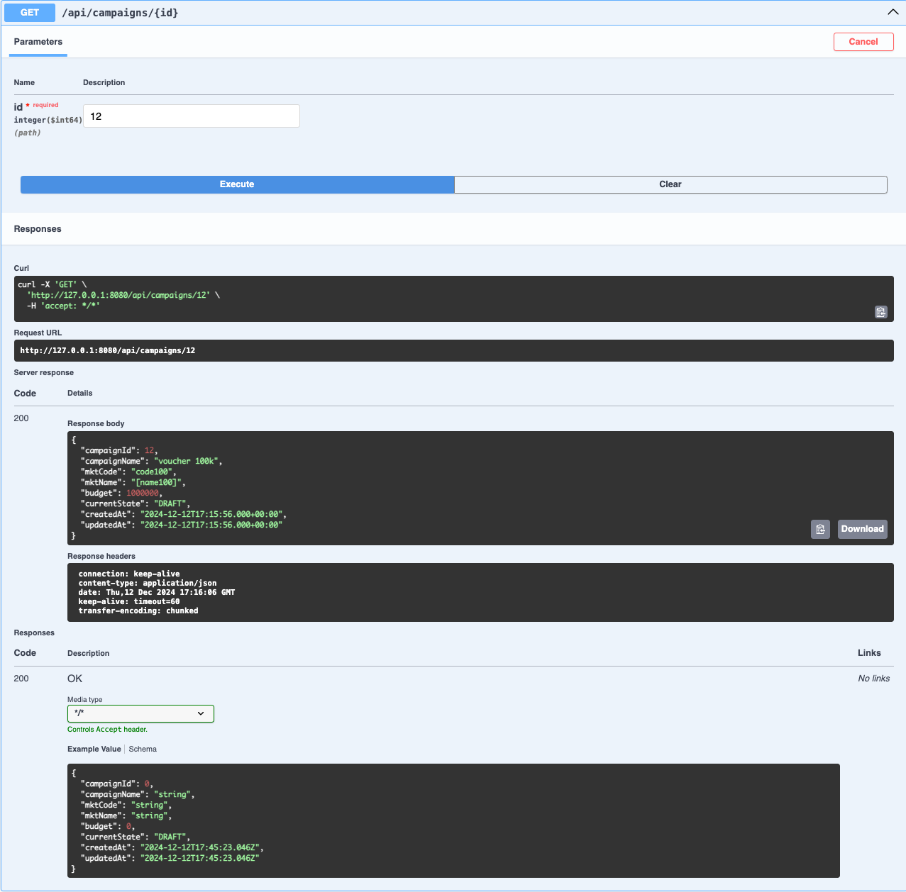
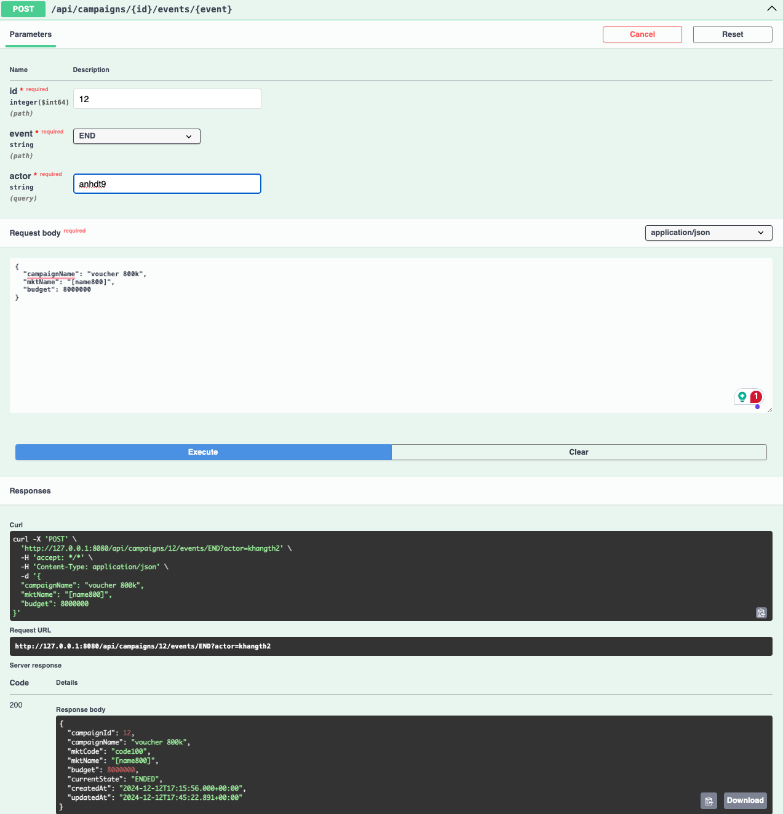

# Spring state machine demo

## Introduction
This is a simple demo of Spring state machine. It is a simple state machine that can be used to manage the state of a simple object. 

## APIs
### 1. Create a new campaign

### 2. Get a campaign by id

### 3. Trigger a campaign event (edit, approve, reject)
